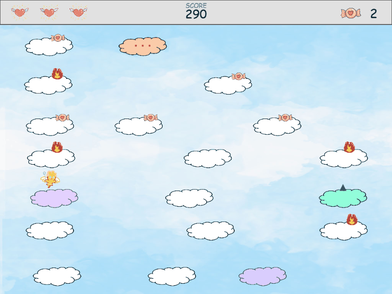

# Up Up Angel

A vertical platformer built with [p5.js](https://p5js.org/). Jump from cloud to cloud, dodge ghosts and hellfire, collect candy, and reach the halo at the top.

Unlike *Doodle Jump*, jumping is **manual** — you decide when to leave the ground. That one change turns a reflex game into a game about timing and reading the platforms ahead.



## Play

The game is pure client-side JavaScript — no build step, no backend.

**Online:** https://bryant0909.github.io/skyward/
*(GitHub Pages, served from `/docs` on `main`)*

**Locally:**

```bash
npm start
```

Then open http://localhost:8123/.

## Controls

| Input | Action |
|---|---|
| `←` `→` | Move |
| `Space` | Jump — tap for a short hop, hold for full height |
| `ESC` / `P` | Pause |
| `M` | Mute |
| `Enter` | Advance through menus |

On touch devices, on-screen buttons appear automatically — a left/right pad and a jump button. They are hidden on desktop.

## Game modes

Three difficulties, each changing the terrain as well as the hazards:

| | Moving clouds | Cloud speed | Level gap | Hazards |
|---|---|---|---|---|
| **Heaven's Blessing** | 35% | ×0.80 | 55–80 px | Candy only |
| **Sacred Trial** | 50% | ×1.00 | 60–88 px | + Hellfire |
| **Divine Judgement** | 62% | ×1.35 | 65–95 px | + Ghosts |

**Endless mode** can be toggled on the difficulty screen and combines with any difficulty. Clouds that scroll off the bottom are recycled back to the top, so there is no halo and no ending — the run lasts until you lose your last life, and the hazard mix ramps up with altitude.

## Gameplay

**Clouds**

| | Behaviour |
|---|---|
| White | Solid ground |
| White, drifting | Moves horizontally and carries you with it |
| Green, with an arrow | Spring — jumping from it goes 1.5× higher |
| Lavender, translucent | Vanishing — fades away a moment after you land |
| Orange, with cracks | Breakable — starts falling the moment you touch it |

Vanishing and breakable clouds are drawn differently *before* you touch them, so a route can always be read in advance.

**Items**

- **Candy** — three of them grant an extra life (three lives maximum)
- **Ghosts** and **hellfire** — cost a life on contact
- **Halo** — sits on the final cloud and wins the run
- Falling all the way to the ground also costs a life

**Scoring**

```
score = highest altitude reached / 10
      + candies collected × 50
      + 1000 if you reach the halo
```

Altitude uses the highest point of the run, so falling never costs you points. High scores are stored per difficulty in `localStorage`, with endless mode tracked separately.

## Development

```bash
npm install        # dev dependencies (ESLint, Vitest) — the game itself has none
npm start          # local server on :8123
npm test           # run the test suite
npm run lint       # ESLint
```

The dev server sends `no-store` headers. That matters more than it sounds: with ordinary caching it is easy to end up running a *mix* of old and new source files after an edit, which produces symptoms that look like real bugs.

### Testing

The game is a set of plain `<script>` files sharing one global scope, with no exports. Rather than restructure it for testability, the tests load the real source files into a `node:vm` context with a stubbed p5 — the same way a browser would, in the same order as `index.html`. **No production code is modified for testing.**

128 tests cover collision detection, scoring and persistence, the camera, jump assists, cloud behaviour, level generation, and endless-mode recycling. Several encode past bugs so they cannot silently return.

### Notes on the code

- **Coordinates are fixed at 800×600.** The canvas is scaled to fill the window by CSS, and p5 converts pointer coordinates back automatically, so no game logic needs to know the display size.
- **The camera moves in steps.** While you are rising it does not move at all; it catches up only once you land on a higher platform. Falling below the rest line switches it to continuous following, and a ceiling forces it to follow if a spring launch would otherwise carry you off-screen.
- **Collision is swept**, comparing the path travelled between frames rather than a single instant — at full falling speed a fixed-window check misses well over half of all objects.
- ESLint is configured with an explicit allow-list of shared globals, so a typo or a forgotten declaration is an error rather than an accidental new global.

## Project structure

```
docs/               # everything GitHub Pages serves
  index.html
  style.css
  assets/           # art and audio
  src/
    sketch.js       # setup, screens, game loop, camera
    score.js        # scoring and high-score persistence
    controls.js     # on-screen touch controls
    endless.js      # endless-mode cloud recycling
    classes/        # Player, Cloud and its variants, Objects and its variants
test/
  harness.js        # loads the game into node:vm with a stubbed p5
tools/
  devserver.py      # local static server with caching disabled
```

## Credits

Up Up Angel began as a six-person group project for **COMSM0166 Software Engineering** at the University of Bristol in 2025. The concept, artwork and original design were developed together by the team:

| Name | GitHub |
|---|---|
| Bryant Lin | [@Bryant0909](https://github.com/Bryant0909) |
| Naiwen Tsui | [@Naiwen1027](https://github.com/Naiwen1027) |
| Zhu Xuefei | [@muler-hussel](https://github.com/muler-hussel) |
| Pinchun Shen | [@PinChuns](https://github.com/PinChuns) |
| Chih Hsien Ho | [@Cindy626](https://github.com/Cindy626) |
| Cyunwun Lin | [@CarminaTW](https://github.com/CarminaTW) |

Character, background and object artwork by Pinchun Shen and Chih Hsien Ho.

**This repository is an independent continuation of that project. All development and maintenance from 2026 onwards is my own work** — including the scoring system, endless mode, the new cloud types, the jump and camera rework, touch support, responsive layout, and the test suite.

## License

No licence is declared yet. The original game was written collaboratively and the artwork was made by other members of the team, so this repository is not mine alone to relicense. Please ask before reusing the assets.

---

Built with [p5.js](https://p5js.org/) 1.11.1.
